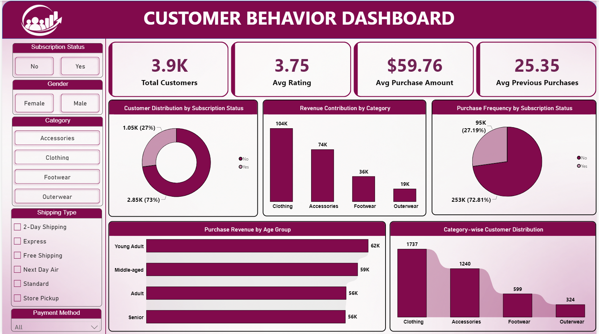

# Customer Behavior Analysis

An end-to-end data analytics project that explores customer shopping behavior using **Python**, **MySQL**, and **Power BI** — from raw transactional data to a business-ready interactive dashboard and report.

---

## 📌 Overview

This project analyzes customer shopping behavior using transactional data from **3,900 purchases** across multiple product categories. The goal is to uncover insights into spending patterns, customer segments, product preferences, and subscription behavior in order to support data-driven business decisions.

The workflow covers the full analytics lifecycle:
**Data Loading → EDA → Cleaning → SQL Analysis → Dashboarding → Reporting.**

---

## 🗂️ Dataset

- **Rows:** 3,900 customer transactions
- **Columns:** 18
- **Key features:**
  - **Demographics:** Age, Gender, Location, Subscription Status
  - **Purchase details:** Item Purchased, Category, Purchase Amount, Season, Size, Color
  - **Shopping behavior:** Discount Applied, Promo Code Used, Previous Purchases, Frequency of Purchases, Review Rating, Shipping Type
- **Data quality:** 37 missing values found in the Review Rating column, imputed using the median rating of each product category.

---

## 🛠️ Tools & Technologies

| Category | Tools |
|---|---|
| Data Loading & Cleaning | Python (pandas) |
| Exploratory Data Analysis | Python (pandas, matplotlib/seaborn) |
| Database & Querying | MySQL Server |
| Dashboarding | Power BI |
| Reporting | PowerPoint (PPTX) |

---

## 🔍 Steps Performed

1. **Data Loading** – Imported the raw dataset into Python using `pandas`.
2. **Exploratory Data Analysis (EDA)** – Used `df.info()` and `.describe()` to understand structure, data types, and summary statistics.
3. **Data Cleaning**
   - Checked for and handled missing values (Review Rating imputed by category median).
   - Standardized column names to `snake_case`.
   - Engineered new features: `age_group` (binned ages) and `purchase_frequency_days`.
   - Checked for redundancy between `discount_applied` and `promo_code_used`, and dropped the redundant column.
4. **Database Integration** – Loaded the cleaned dataset into **MySQL Server** for structured SQL analysis.
5. **SQL Analysis** – Wrote business-driven SQL queries to answer key questions, including:
   - Revenue by gender
   - High-spending customers who used discounts
   - Top 5 products by review rating
   - Shipping type comparison (Standard vs. Express)
   - Subscribers vs. non-subscribers (spend & revenue)
   - Discount-dependent products
   - Customer segmentation (New / Returning / Loyal)
   - Top 3 products per category
   - Repeat buyers vs. subscription status
   - Revenue by age group
6. **Dashboard Design** – Built an interactive Power BI dashboard to visualize all key insights.
7. **Reporting** – Compiled findings into a professional PPT report with business recommendations.

---

## 📊 Power BI Dashboard

The dashboard provides an interactive view of customer behavior with filters for **subscription status, gender, category, shipping type, and payment method**.



**Highlights:**
- **3.9K** total customers | **3.75** average rating | **$59.76** average purchase amount | **25.35** average previous purchases
- Clothing leads revenue contribution (**$104K**) among all categories
- Non-subscribers account for **73%** of the customer base
- Young Adults are the highest revenue-generating age group

---

## 📈 Results & Key Insights

- **Revenue by Gender:** Male customers generated ~2.1x more revenue than female customers ($157,890 vs. $75,191).
- **Discount-Driven High Spenders:** 839 customers used a discount but still spent above the average purchase amount.
- **Top-Rated Products:** Gloves, Sandals, Boots, Hat, and Skirt received the highest average review ratings.
- **Shipping Impact:** Express shipping customers spend marginally more on average ($60.48) than Standard shipping customers ($58.46).
- **Subscription Behavior:** Non-subscribers drive ~73% of total revenue purely due to volume; average spend per customer is nearly identical across both groups.
- **Discount Dependency:** Hat, Sneakers, Coat, Sweater, and Pants show the highest reliance on discounts (47–50% of purchases).
- **Customer Segments:** 80% of customers fall into the "Loyal" segment, indicating strong repeat-purchase behavior.
- **Age-wise Revenue:** Young Adults contribute the highest revenue ($62,143), followed by Middle-aged, Adult, and Senior groups.

**Business Recommendations:**
- Promote exclusive benefits to boost subscriptions
- Introduce loyalty programs to convert Returning customers into Loyal customers
- Review discount policy on high-discount-dependency products to protect margins
- Highlight top-rated and best-selling products in marketing campaigns
- Focus targeted marketing on high-revenue age groups and Express-shipping users

---

## ▶️ How to Run

1. **Clone the repository**
   ```bash
   git clone https://github.com/<your-username>/customer-behavior-analysis.git
   cd customer-behavior-analysis
   ```

2. **Set up Python environment**
   ```bash
   pip install pandas numpy matplotlib seaborn mysql-connector-python
   ```

3. **Run the EDA & cleaning script**
   ```bash
   python data_cleaning_eda.py
   ```

4. **Load data into MySQL**
   - Create a database in MySQL Server
   - Import the cleaned dataset (CSV) into a table
   - Run the queries from the `/sql` folder to reproduce the analysis

5. **Open the Power BI dashboard**
   - Open the `.pbix` file in Power BI Desktop
   - Refresh the data source to point to your local MySQL database

6. **View the report**
   - Open `Customer_Shopping_Behavior_Analysis.pptx` for the full project report and business recommendations

---

## 👤 Author

**Dheeraj Gupta**
